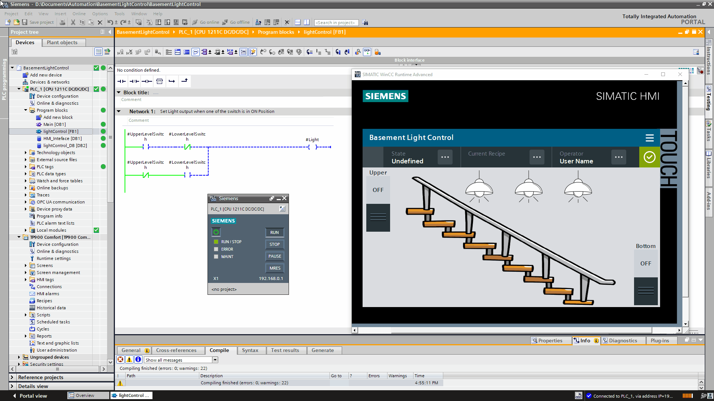

# BasementLightControl

### Table of Contents 
1. [Folder Structure](#folderstructure)
2. [Purpose](#purpose)
3. [Tools Used](#toolsused)
4. [Demo](#demo)

### Folder Structure <a name="folderstructure"></a>
```
BasementLightControl

|---images (all images for README.md file)
|---|---basementlightdemo.gif (program demo)

|---src (source code)
|---|---BasementLightControl.zap16 (PLC & HMI Code for V16)

|---TIAPortalScreenshots.pdf (TIA screenshots of PLC & HMI programming)
|---README.md (helpful readme file)
```

### Purpose <a name="purpose"></a>
To implement a 3-way switch control logic in a PLC program for a Basement Control Light System. There are two switches: one for upper-level and one for lower-level. Both of the switch control the Basement light. When both of the switches are in the same position, the light must be OFF, when one switch is ON and the other is OFF, then only the light is OFF. Below is a Truth table describing the logic.</br>
<center>
| Upper Level Switch | Lower Level Switch | Light Output |
|:------------------:|:------------------:|:------------:|
|         OFF        |         OFF        |      OFF     |
|         OFF        |         ON         |      ON      |
|         OFF        |         ON         |      ON      |
|         ON         |         ON         |      OFF     |
</center>

### Tools Used <a name="toolsused"></a>
1. SIMATIC STEP 7 (TIA Portal V16) </br>
2. WinCC RT Advanced (TIA Portal V16 option) </br>
3. PLCSIM </br>

### Demo <a name="demo"></a>
<p align="center">
  
  <b>Functional Demo</b>
</p>
</br>
</br>
