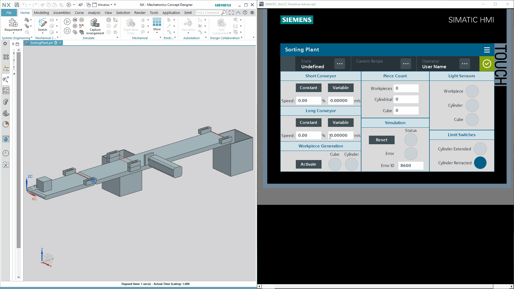

# SortingPlant

### Table of Contents 
1. [Folder Structure](#folderstructure)
2. [Purpose](#purpose)
3. [Tools Used](#toolsused)
4. [Demo](#demo)

### Folder Structure <a name="folderstructure"></a>
```
SortingPlant

|---images (all images for README.md file)
|	|---sortplant_constantspeed_demo.gif (constant speed operation)
|	|---sortplant_reset_demo.gif (working demo of reset sequence)
|	|---sortplant_varspeed_demo.gif (variable speed operation)

|---src (source code)
|---|---NX_MCD.zip (all NX 3D prt files)
|---|---Sorting Plant Control.zap16 (PLC & HMI Code for V16)

|---sce-150-002-mcd-tia-com-digital-twin-at-education-development-tia-hsd-0919-en.docx (detailed technical info)
|---sce-150-002-mcd-tia-com-digital-twin-at-education-development-tia-hsd-0919-en.pdf (detailed technical info)
|---TIAPortalScreenshots.pdf (TIA screenshots of PLC & HMI programming)
|---README.md (helpful readme file)
```

### Purpose <a name="purpose"></a>
To virtually commission the digital twin of a sorting plant by developing PLC & HMI code using Software-in-the-loop (SIL) and test driven development approach in LAD language. In addition to the program for the CPU and the HMI, configuration of the mechatronic model from the Mechatronics Concept Designer (MCD) is also required. The interface between virtual PLC, simulated HMI and the digital twin is implemented using PLCSIM Advanced.

### Tools Used <a name="toolsused"></a>
1. SIMATIC STEP 7 (TIA Portal V16) </br>
2. WinCC RT Advanced (TIA Portal V16 option) </br>
3. PLCSIM Advanced V3.0 </br>
4. NX with MCD option </br>

### Demo <a name="demo"></a>
<p align="center">
  
  <b>Constant Speed Operation</b>
</p>
</br>
</br>
<p align="center">
  
  <b>Variable Speed Operation</b>
</p>
</br>
</br>
<p align="center">
  
  <b>Reset sequence test</b>
</p>
</br>